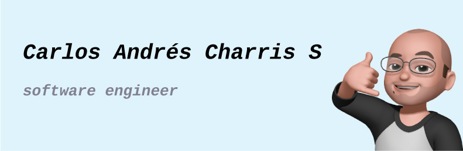

  

  

  
  
  

Hi People 👋
 
 
I'm Carlos Andrés Charris Sandoval, a Software Engineering  at Politécnico GranColombiano University, Bogotá, Colombia. I am a Full-Stack Developer enthusiast. I also passionate entrepreneur, with the ability to create technology teams, train, and execute software developments
 
 
Areas of Expertise/Interest: Software Engineering, UI-UX Designing.

<h3>
  Skills 💼
</h3>
<h4>Programming Languages</h4>

  
  
  
  

<h4>Frontend Development</h4>

  
  
  
  
  
  
  
  
  
  
  
  
  

<h4>Backend Development</h4>

  
  
  
  
  
  
  
  
  
  
  
  

<h4>Tools & Technologies</h4>

  
  
  
  
  
  
  
  
  
  
  
  
  
  
    
  
  

<h3>
  Projects 👨‍💻
</h3>
<ul>
  <li><a href="https://testdeploy-f0876.web.app/">PROYECTO DE INVESTIGACIÓN
 | Universidad Nacional - Facultad Medicina - 2017</a></li>
  <li><a href="https://ludotecas-unal.firebaseapp.com/">PROYECTO DE INVESTIGACIÓN
 | Universidad Nacional - Facultad Medicina - 2018</a></li>
  <li><a href="https://game-focus.firebaseapp.com/">TOMA EL CONTROL
 | GamerFocus - PLAYSTATION - 2018</a></li>
  <li><a href="https://student-skill-2887a.firebaseapp.com/#/login">PROYECTO DE INVESTIGACIÓN
 | Universidad Nacional - Facultad Medicina - 2019</a></li>
  <li><a href="https://twitter.com/fedesoftcol/status/1064617542365384707">PIENSA DIGITAL | FEDESOFT - MINTIC -2018</a></li>
  <li><a href="https://github.com/Project-SafeShop"> MISION TIC 2022 | UNVERSIDAD DE ANTIOQUIA - MINTIC - 2021</a></li>
</ul>

<h3>
  GitHub Stats 📊
</h3>

  

  

